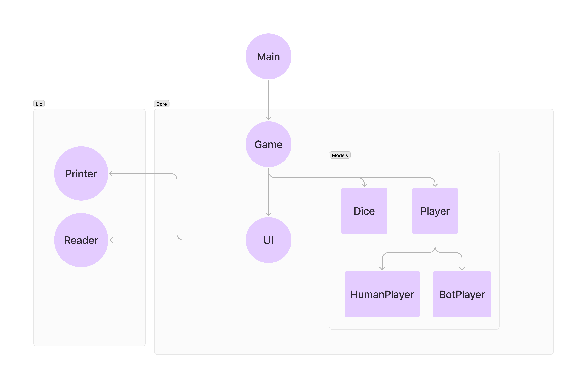

# Haskell Dice Game

Este trabalho foi desenvolvido como parte da disciplina DCC019 - Linguagens de Programação - UFJF, ministrada pelo professor Leonardo Vieira dos Santos Reis .

Este trabalho descreve a implementação de um jogo de raciocínio lógico denominado "Jogo dos Dados" utilizando a linguagem funcional Haskell. O jogo é composto por dois jogadores que alternam turnos para girar ou remover dados com base nas faces voltadas para cima. O vencedor é o jogador que retirar o último dado. A implementação contempla dois níveis de dificuldade para o computador: um nível fácil, com jogadas aleatórias, e um nível difícil, com jogadas otimizadas segundo uma estratégia vencedora.


## Como rodar

```bash
cabal update
cabal install --lib random
cabal install mtl
```

Depois realizar os passos acima, tive depois que digitar:

```bash
ghci

:m + System.Random
:set -package mtl
:l main.hs
main

:q
```


## Estrutura do Projeto

O projeto de jogo de dados em Haskell é estruturado em três módulos principais: `Core`, `Models`, e `Lib`.

- **Módulo `Core`**: Contém os componentes principais.
  - `Game`: Gerencia a lógica central.
  - `UI`: Medeia as interações entre o usuário e o jogo.
- **Módulo `Models`**: Define os elementos fundamentais do jogo, como `Dice` e `Player`.
  - `Player`: Representa jogadores humanos (`HumanPlayer`) e bots (`BotPlayer`).
- **Módulo `Lib`**: Contém funções auxiliares `Printer` e `Reader`, responsáveis pela impressão e leitura de dados.




### Estrutura de Diretórios

```plaintext
Source
├── Core
│   ├── Board
│   │   ├── Board.hs
│   │   ├── Dice.hs
│   ├── Players
│   │   ├── BotPlayer.hs
│   │   ├── HumanPlayer.hs
│   │   ├── Player.hs
│   ├── Game.hs
│   ├── UI.hs
├── Lib
│   ├── Printer.hs
│   ├── Reader.hs
├── Types
│   ├── BotLevel.hs
│   ├── Move.hs
│   ├── SetupData.hs
Test
│   HardBot.hs
main.hs
```

## Estrutura de Dados

Para a implementação das funcionalidades do "Jogo dos Dados", diversos tipos de dados são utilizados. A seguir, detalha-se a estrutura de dados empregada no projeto.

### Estado do Jogo

O tipo `GameState` encapsula o estado atual do jogo, incluindo uma lista de jogadores e o tabuleiro.

```haskell
data GameState = GameState
  { players :: [Player],
    board :: Board
  }
  deriving (Show)
```


### Mônada do Jogo

O tipo GameMonad é uma mônada utilizada para a manipulação do estado do jogo e operações de entrada e saída. Ele é definido como uma instância do monad transformador de estado StateT, combinando o estado do jogo (GameState) com a mônada de entrada e saída (IO).

```haskell
type GameMonad = StateT GameState IO
```

Esta mônada permite que o estado do jogo seja manipulado de forma monádica, facilitando operações que envolvem tanto a gestão do estado quanto a realização de ações de entrada e saída.

## Jogadores
Os jogadores no jogo podem ser de dois tipos: humano ou bot.

### Tipo PlayerType
Define se o jogador é humano ou bot.

```haskell
data PlayerType = Human | Bot
  deriving (Show, Eq)
```

### Tipo Player
Representa um jogador humano ou um bot.

```haskell
data Player
  = HumanPlayerType HumanPlayer
  | BotPlayerType BotPlayer
  deriving (Show)
```

#### Tipo HumanPlayer
Contém o nome do jogador humano.

```haskell
data HumanPlayer = HumanPlayer
  { humanName :: String
  }
  deriving (Show)
```

#### Tipo BotPlayer
Inclui o nome do bot e seu nível de dificuldade.

```haskell
data BotPlayer = BotPlayer
  { botName :: String,
    botLevel :: BotLevel
  }
  deriving (Show)
```

### Dados e Tabuleiro

#### Tipo Dice
Representa um dado com uma face voltada para cima.

```haskell
data Dice = Dice {value :: Int}
  deriving (Show)
```

#### Tipo Board
Representa o estado atual do tabuleiro como uma lista de dados.

```haskell
type Board = [Dice]
```


### Tipos
O módulo Types contém definições de tipos de dados que ajudam a estruturar e organizar a informação utilizada pelo jogo e pelas estratégias dos jogadores.

#### Níveis de Dificuldade do Bot
Define os níveis de dificuldade para o bot.

```haskell
data BotLevel = Easy | Hard
  deriving (Show, Eq)
```


#### Movimentos
Define as operações que podem ser realizadas no jogo.

```haskell
type Index = Int

data Move
  = UpdateMove {updateIndex :: Index, newValue :: Int}
  | RemoveMove {removeIndex :: Index}
  deriving (Show)
```


#### Tipo MoveType
Distingue entre os tipos de movimentos possíveis.

```haskell
data MoveType = Update | Remove
  deriving (Show, Eq)
```

#### Dados de Configuração
Contém as informações necessárias para configurar o jogo.

```haskell
data SetupData = SetupData
  { numDices :: Int,
    setupPlayerName :: String,
    setupBotLevel :: BotLevel
  }
  deriving (Show)
  ```
